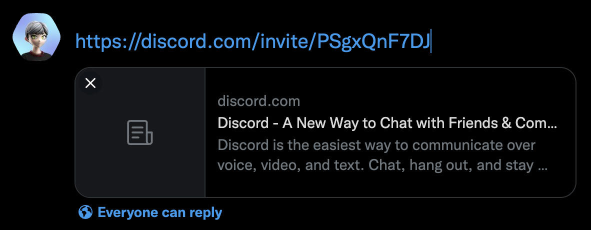
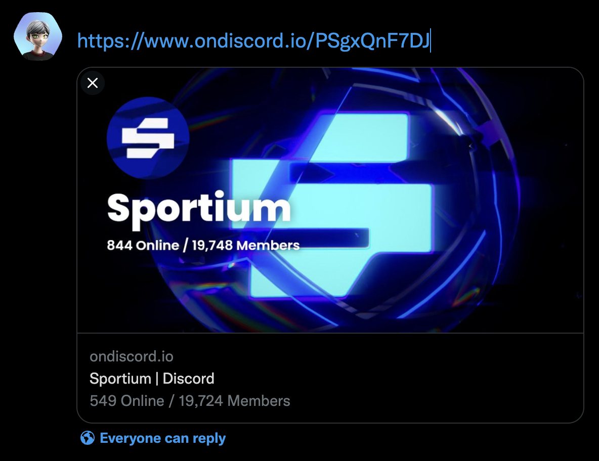
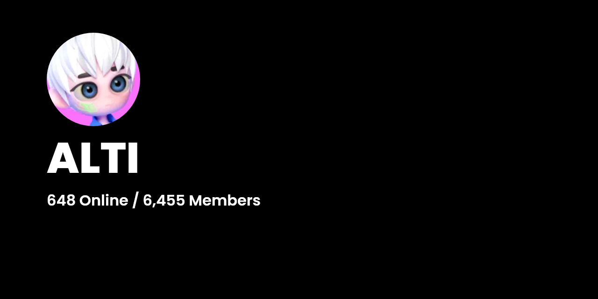
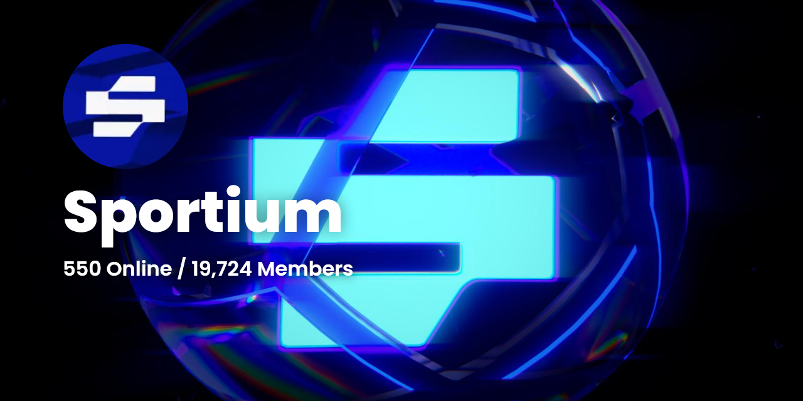
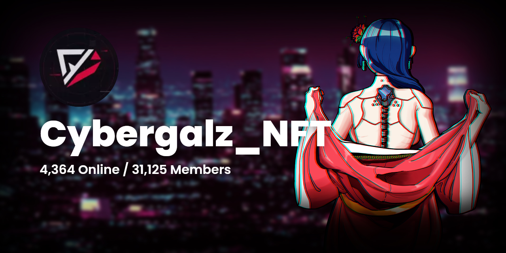
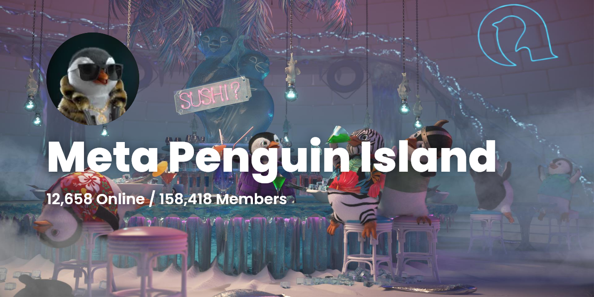
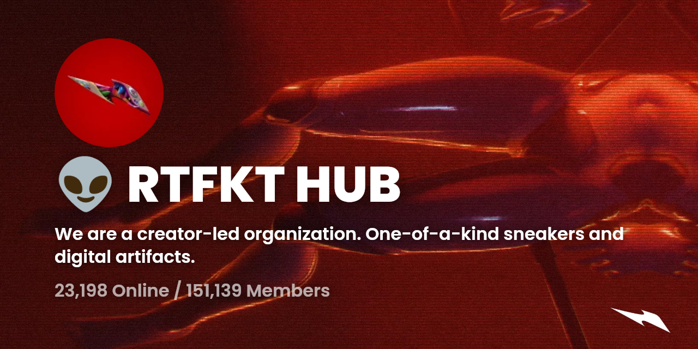

# OnDiscord.io

> 👾 Wrap invite links from [Discord](https://discord.com/) **with Metadata**

- Uses [`@napi-rs/canvas`](https://github.com/Brooooooklyn/canvas) to render images server-side.
- Server metrics are shown to source legitimacy
  - Number of members online
  - Total members joined

|            Before             |            After             |
| :---------------------------: | :--------------------------: |
|  |  |

## Usage

Just pass the invite code or slug to `https://ondiscord.io` and you're ready to share!

- `https://discord.com/invite/sportium` 👉 `https://ondiscord.io/sportium`

- `https://discord.gg/xhSWv9ynGV` 👉 `https://ondiscord.io/xhSWv9ynGV`

## Results

### Without Splash

### With Splash

### With Emojis and Description

## Roadmap

- [ ] Frontend Generator & Dashboard
- [ ] [Abit.ly](https://abit.ly)(fast URL shortener) Integration
- [ ] Analytics Support
- [ ] Partner with Discord bots
